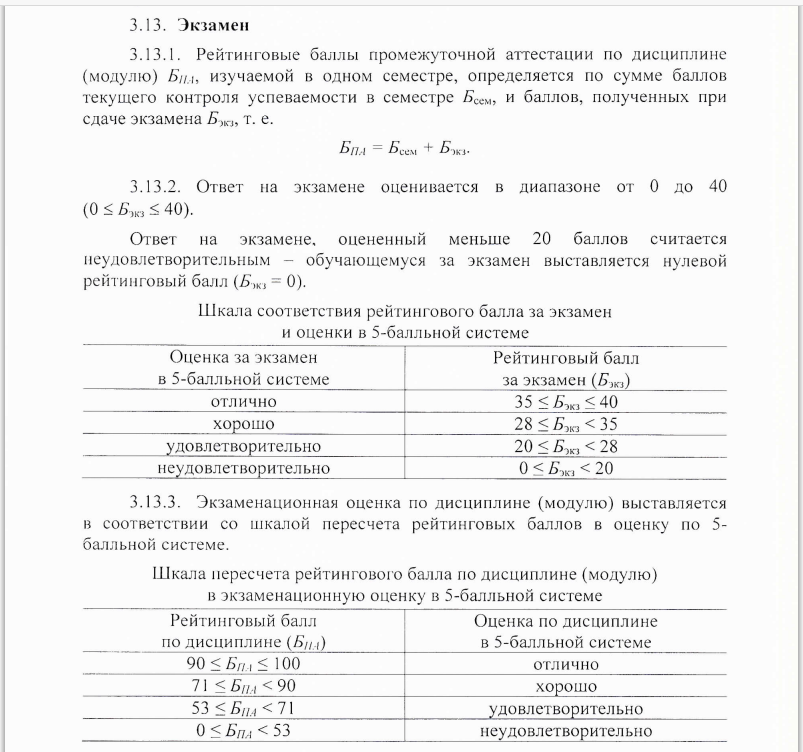
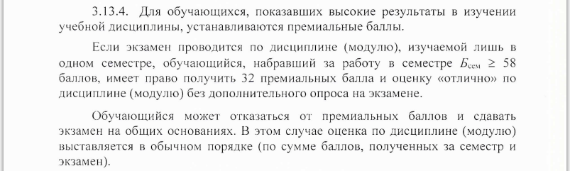

## Консультация

Видео-консультация доступна по ссылке: https://youtu.be/gEivDSIn7m0

Если после просмотра у вас остались вопросы, задавайте из в личных сообщениях (контакты в разделе "О преподавателях") или в беседе по курсу.

## Материалы к экзамену

1. Экзаменационный тест будет состоять из 100 вопросов набранных случайным образом из следующих тестов:
   - [Тест 1](https://moodle.cfuv.ru/mod/quiz/view.php?id=594497)
   - [Тест 2](https://moodle.cfuv.ru/mod/quiz/view.php?id=594498)
   - [Тест 3](https://moodle.cfuv.ru/mod/quiz/view.php?id=595464)
   - [Тест 4](https://moodle.cfuv.ru/mod/quiz/view.php?id=596773)
   - [Тест по указателям](https://moodle.cfuv.ru/mod/quiz/view.php?id=602956)

2. Билет:

   - В каждом билете будет 2 теоретических вопроса из [списка экзаменационных вопросов](./exam_questions.md);

   - Экзаменационная задача. В задаче будет необходимо написать класс реализующий заданный по условию интерфейс. Итоговая оценка за задачу будет определяться количеством пройдённых тестов.

## Процедура экзамена

Итоговая оценка за курс определяется в соответствии с [Приказом №135 от 11.02.2020 Об утверждении Порядка применения балльно-рейтинговой системы оценивания успеваемости обучающихся по программам ВО в ФГАОУ ВО "КФУ им. В.И. Вернадского"](https://vladimirchabanov.github.io/rules/2020.02.11 Приказ № 135.pdf);

Получение автомата по экзамену возможно только в случае предусмотренном в приказе:

Экзамен состоит из двух последовательных этапов: экзаменационное тестирование (проверяет полноту знаний по курсу) и ответ на билет (проверяет глубину знаний по курсу).  

Одновременное количество обучающихся проходящих экзаменационное оценивание определяется количеством рабочих мест в кабинете (примерно 10). После освобождения рабочего места следующий обучающийся приступает к сдаче экзамена.

Оценка за экзамен ($Б_{экз}$​) определяется по формуле: $Б_{экз}=40 \cdot \frac{Б_{тест}}{100} \cdot \frac{Б_{билет}}{100}$,

где $Б_{тест}$ - оценка за экзаменационный тест; $Б_{билет}$ - оценка за ответ на билет.

1. Экзаменационный тест состоит из 100 вопросов и оценивается от 0 до 100 баллов. На прохождение теста выделяется 90 минут.  
   Если за тест набрано менее 50 баллов, то обучающийся получает нулевой балл за экзамен без необходимости отвечать на билет, т.к. даже при 100% ответе на него экзаменационный балл будет меньше 20 (см. пункт приказа 3.13.2 ).

   Если за тест набрано более 50 баллов, то обучающийся переходит на этап ответа на экзаменационный билет.

2. Ответ на экзаменационный билет. Оценка за ответ на билет определяется как сумма оценок за задачу и устный ответ на теоретические вопросы.  

   - Задача. Обучающийся случайным образом вытягивает одну из экзаменационных задач. Решение задачи должно быть загружено на сервис Яндекс-контест (по ссылке указанной в билете) и оценивается пропорционально количеству пройденный тестов.  
     На решение задачи отводится до 45 минут. За задачу выставляется до 50 баллов из 100 возможных за ответ на билет.
   - 2 теоретических вопроса. Обучающийся случайным образом вытягивает билет с вопросами.
     На подготовку к ответу отводится до 45 минут. За ответ на каждый из вопросов выставляется до 25 баллов из 100 возможных за ответ на билет.

**Внимание!**

1. Использование дополнительных источников информации на экзамене не допускается. Разрешено использовать только: голову (свою), чистую бумагу и ручку, онлайн компилятор для решения задачи.
2. Рекомендуется взять свою технику, т.к. компьютеры в экзаменационной аудитории могут начать обновляться и из-за этого тормозить. Т.к. за отведённое время экзамен должны пройти все, то, даже в случае проблем с техникой, дополнительного времени выделятся не будет.
3. Проверьте, что вы можете войти в свой moodle-аккаунт (нужен для теста).
4. Проверьте, что вы можете войти в свой аккаунт на Яндекс-контест (нужен для задачи). Если вы не можете вспомнить данные от старого аккаунта, то заведите новый.
